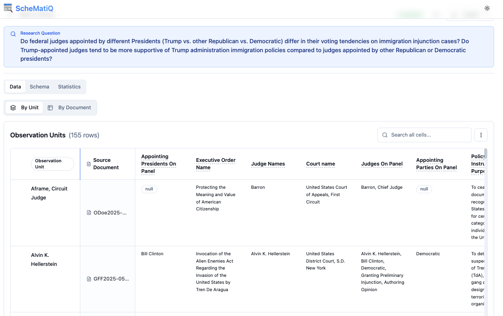

<div align="center">


# ScheMatiQ

**A framework for query-driven schema discovery and structured data extraction from document collections.**

<p align="center">
 <a href="">
    
 </a>
 <a href="https://www.schematiq-ai.com/">
    
 </a>
 <a href="https://www.apache.org/licenses/LICENSE-2.0">
    
 </a>
</p>

[](https://www.python.org/downloads/)
[](https://reactjs.org/)
[](https://fastapi.tiangolo.com/)

</div>

ScheMatiQ helps domain experts turn a research question and a document collection into a structured table — no predefined schema needed. The system uses a backbone LLM to iteratively discover an annotation schema, then extracts structured data grounded in the source documents. A web interface at [schematiq-ai.com](https://www.schematiq-ai.com/) supports human–AI collaboration, letting users inspect, revise, and refine results at every stage.

<div align="center">
  
</div>

## Table of Contents

- [How It Works](#how-it-works)
- [Getting Started](#getting-started)
- [Features](#features)
- [Development](#development)
- [Contributing](#contributing)
- [Citation](#citation)

## How It Works

ScheMatiQ runs a three-stage pipeline:

```
Research Question    Observation Unit      Schema          Structured Data      Structured
  + Documents    ──▶   Discovery      ──▶  Discovery  ──▶   Extraction     ──▶   Table
```

1. **Observation Unit Discovery** — Identifies the entity each row represents (e.g., "research paper", "patient").
2. **Schema Discovery** — Iteratively refines annotation schema fields across document batches using embedding-based retrieval, LLM generation, and semantic merging.
3. **Structured Data Extraction** — Produces a structured table with values grounded in the source documents.

## Getting Started

### Web Application

Go to **[www.schematiq-ai.com](https://www.schematiq-ai.com/)**, enter a research question, upload your documents, and start discovery. No installation required.

### Core Library

Use `schematiq-lib` as a standalone Python package — no web interface needed.

```bash
cd schematiq-lib && pip install -e .
```

```python
from schematiq import GeminiLLM, EmbeddingRetriever, discover_observation_unit

llm = GeminiLLM(model="gemini-2.5-flash")
retriever = EmbeddingRetriever(k=8)
documents = [open(f).read() for f in your_files]

observation_unit = discover_observation_unit(documents, "your research question", llm)
```

See [Features > Core Library](#core-library-schematiq-lib) for the full API surface.

## Features

### Web Application

- **Real-time Progress** — WebSocket-based live updates during discovery and extraction
- **Interactive Schema Editor** — Inspect and revise schema elements — add, edit, remove, or merge fields
- **Continue Discovery** — Extend schema after initial convergence by processing more documents
- **Reextraction** — Re-run structured data extraction with the current or edited schema
- **Cost Estimation** — Preview estimated API costs before running expensive operations
- **Document Upload** — PDF and TXT support with automatic preprocessing
- **Export** — Download results as CSV, JSON, or JSONL

### Core Library (schematiq-lib)

- **Backbone LLM Support** — OpenAI, Google Gemini, and Together AI
- **Observation Unit Discovery** — Automatically determines what entity each row represents
- **Embedding Retrieval** — Passage-level retrieval for long documents (sentence-transformers)
- **Iterative Schema Discovery** — Retrieval → LLM generation → semantic merging → convergence check
- **Parallel Extraction** — Multi-threaded document processing with incremental writes
- **Evaluation** — Schema and row-level evaluation against ground truth

```python
from schematiq import Schema, Column, EmbeddingRetriever
from schematiq.core.llm_backends import GeminiLLM
from schematiq.core import schematiq as ScheMatiQ
from schematiq.value_extraction.main import build_table_jsonl
```

<details>
<summary><h2>Development</h2></summary>

### Architecture

```
ScheMatiQ/
├── frontend/        # React 18 + TypeScript + Tailwind/shadcn
├── backend/         # FastAPI + WebSocket server
├── schematiq-lib/   # Core ScheMatiQ algorithms (Python package)
└── research/        # Datasets, experiments, evaluation results
```

**Request flow:** Frontend → Backend routes (`app/api/routes/`) → Services (`app/services/`) → schematiq-lib (`schematiq/`) → Backbone LLM. Real-time progress via WebSocket.

### Local Setup

To run the full web application locally (for development or self-hosting):

**Prerequisites:** Node.js 18+, Python 3.10+, at least one LLM API key (OpenAI, Gemini, or Together AI)

```bash
# Backend
cd backend
pip install -r requirements.txt
cd ../schematiq-lib && pip install -e . && cd ../backend
# Set OPENAI_API_KEY, GEMINI_API_KEY, or TOGETHER_API_KEY in environment
uvicorn app.main:app --reload --port 8000
```

```bash
# Frontend (separate terminal)
cd frontend
npm install --legacy-peer-deps
npm start
# Opens at http://localhost:3000
```

### Configuration

**Backend** (at least one LLM key required):

| Variable | Description |
|----------|-------------|
| `OPENAI_API_KEY` | OpenAI API key |
| `GEMINI_API_KEY` | Google Gemini API key |
| `TOGETHER_API_KEY` | Together AI API key |
| `ALLOWED_ORIGINS` | CORS origins (default: `http://localhost:3000`) |
| `SUPABASE_URL` / `SUPABASE_KEY` | Cloud storage (production) |
| `MAX_CONCURRENT_SESSIONS` | Concurrent session limit (default: 5) |
| `DEVELOPER_MODE` | Set `true` to unlock all features (see below) |

**Frontend:**

| Variable | Description |
|----------|-------------|
| `REACT_APP_API_URL` | Backend URL (default: `http://localhost:8000`) |
| `REACT_APP_WS_URL` | WebSocket URL (default: `ws://localhost:8000`) |

#### Release Mode vs Developer Mode

Release mode (default) restricts features for public use. Set `DEVELOPER_MODE=true` to unlock.

| Setting | Release Mode | Developer Mode |
|---------|-------------|----------------|
| Document limit | 20 | 10,000 |
| LLM configuration | Locked (Gemini only) | User-configurable |
| Schema creation model | gemini-2.5-flash | User's choice |
| Extraction model | gemini-2.5-flash-lite | User's choice |
| Research data collection | Enabled (if configured) | Disabled |

### Deployment (Railway)

Both services deploy on **Railway** using **Dockerfile-based** builds:

- **Frontend** — Multi-stage Node 18 → Nginx (`frontend/Dockerfile`, `frontend/railway.json`)
- **Backend** — Python 3.11-slim, CPU-only PyTorch, copies `schematiq-lib/` at build time (`backend/Dockerfile`, no `railway.json`)

</details>

## Contributing

Contributions are welcome! Please open an issue or pull request on [GitHub](https://github.com/shaharl6000/QueryDiscovery/issues).

## Citation

If you use ScheMatiQ in your research, please cite:

```bibtex
@inproceedings{schematiq2026,
  title     = {ScheMatiQ: Query-Driven Schema Discovery and Structured Data Extraction from Document Collections},
  author    = {TODO},
  booktitle = {TODO},
  year      = {2026}
}
```

## License

MIT License — see [LICENSE](LICENSE).
