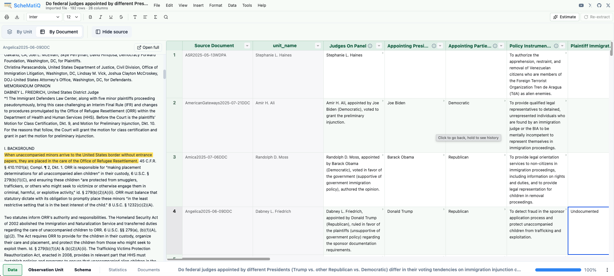

<div align="center">


# ScheMatiQ

**A framework for query-driven schema discovery and structured data extraction from document collections.**
<p align="center" style="font-size: 0;">
  <a href="https://arxiv.org/pdf/2604.09237" target="_blank" rel="noopener noreferrer"></a>
  <a href="https://www.schematiq-ai.com/" target="_blank" rel="noopener noreferrer"></a>
  <a href="LICENSE"></a>
<p align="center" style="font-size: 0;">
  <a href="https://www.python.org/downloads/" style="display: inline-block; margin: 0 4px;"></a>
  <a href="https://reactjs.org/" style="display: inline-block; margin: 0 4px;"></a>
  <a href="https://fastapi.tiangolo.com/" style="display: inline-block; margin: 0 4px;"></a>
</p>

</div>
ScheMatiQ helps domain experts turn a research question and a document collection into a structured table — no predefined schema needed. The system uses a backbone LLM to iteratively discover an annotation schema, then extracts structured data grounded in the source documents. A web interface at [schematiq-ai.com](https://www.schematiq-ai.com/) supports human–AI collaboration, letting users inspect, revise, and refine results at every stage.

<div align="center">
  
  <br>
  <sub><i>The ScheMatiQ Workspace: the extracted table next to the source document, with the text behind a selected value highlighted.</i></sub>
</div>

## Table of Contents

- [What's New](#whats-new)
- [How It Works](#how-it-works)
- [Getting Started](#getting-started)
- [Features](#features)
- [Development](#development)
- [Contributing](#contributing)
- [Citation](#citation)

## What's New

<!-- Keep short and user-facing: prepend notable, visible changes; skip internals, chores, and small fixes. -->

- A new interface (now the default): a familiar spreadsheet, like Google Sheets, paired with a chat assistant you can ask to build, edit, and refine your table as you go. The previous interface is still available at `/classic`.
- Read your source documents in a side panel, and click any value to see the exact text it came from, highlighted in the document.
- Add more documents to a project whenever you want — their values are extracted and added to the table automatically.
- If a document produces no result, you'll see the model's explanation of why (for example, an empty document, or no observation unit found).
- Save a whole project as a single file, documents included — reopen it later and the documents are still there to view.
- Give the chat assistant your own reference documents to work from — for example, a list of judges' birth dates to pull into a new column.
- Runs on Google's Gemini 3.5 Flash (schema discovery) and 3.5 Flash-Lite (data extraction).

## How It Works

ScheMatiQ runs a three-stage pipeline:

```
Research Question    Observation Unit      Schema          Structured Data      Structured
  + Documents    ──▶   Discovery      ──▶  Discovery  ──▶   Extraction     ──▶   Table
```

1. **Observation Unit Discovery** — Identifies the entity each row represents (e.g., "research paper", "patient").
2. **Schema Discovery** — Iteratively refines annotation schema fields across document batches using embedding-based retrieval, LLM generation, and semantic merging.
3. **Structured Data Extraction** — Produces a structured table with values grounded in the source documents.

## Getting Started

### Web Application

Go to **[www.schematiq-ai.com](https://www.schematiq-ai.com/)**, enter a research question, upload your documents, and start discovery. No installation required.

### Core Library

Use `schematiq-lib` as a standalone Python package — no web interface needed.

```bash
cd schematiq-lib && pip install -e .
```

```python
from schematiq import GeminiLLM, EmbeddingRetriever, discover_observation_unit

llm = GeminiLLM(model="gemini-3.5-flash")
retriever = EmbeddingRetriever(k=8)
documents = [open(f).read() for f in your_files]

observation_unit = discover_observation_unit(documents, "your research question", llm)
```

See [Features > Core Library](#core-library-schematiq-lib) for the full API surface.

## Features

### Web Application

- **Workspace** — A spreadsheet-style interface (the default) with By Unit / By Document views, a Documents tab for browsing and previewing sources, and Statistics and Monitor tabs. The previous interface remains available at `/classic`
- **Chat Assistant** — An agentic, tool-calling assistant that can inspect and edit the schema and data, with optional external reference documents for context
- **Real-time Progress** — WebSocket-based live updates during discovery and extraction
- **Interactive Schema Editor** — Inspect and revise schema elements — add, edit, remove, or merge fields
- **Continue Discovery** — Extend schema after initial convergence by processing more documents
- **Reextraction** — Re-run structured data extraction with the current or edited schema
- **Add Documents** — Add more documents to an existing project and extract them with the current schema; documents that yield no observation unit are surfaced with a reason
- **Cost Estimation** — Preview estimated API costs before running expensive operations
- **Document Upload** — TXT, MD, PDF, DOC, DOCX, RTF, and JSON; non-text formats are converted to plain text automatically before schema discovery and extraction
- **Save & Export** — Save portable project bundles (with source documents), and export results as CSV, JSON, or JSONL

### Core Library (schematiq-lib)

- **Backbone LLM Support** — OpenAI, Google Gemini, and Together AI
- **Observation Unit Discovery** — Automatically determines what entity each row represents
- **Embedding Retrieval** — Passage-level retrieval for long documents (sentence-transformers)
- **Iterative Schema Discovery** — Retrieval → LLM generation → semantic merging → convergence check
- **Parallel Extraction** — Multi-threaded document processing with incremental writes
- **Evaluation** — Schema and row-level evaluation against ground truth

```python
from schematiq import Schema, Column, EmbeddingRetriever
from schematiq.core.llm_backends import GeminiLLM
from schematiq.core import schematiq as ScheMatiQ
from schematiq.value_extraction.main import build_table_jsonl
```

<details>
<summary><h2>Development</h2></summary>

### Architecture

```
ScheMatiQ/
├── frontend/        # React 18 + TypeScript + Tailwind/shadcn
├── backend/         # FastAPI + WebSocket server
├── schematiq-lib/   # Core ScheMatiQ algorithms (Python package)
└── research/        # Datasets, experiments, evaluation results
```

**Request flow:** Frontend → Backend routes (`app/api/routes/`) → Services (`app/services/`) → schematiq-lib (`schematiq/`) → Backbone LLM. Real-time progress via WebSocket.

### Local Setup

To run the full web application locally (for development or self-hosting):

**Prerequisites:** Node.js 18+, Python 3.10+, at least one LLM API key (OpenAI, Gemini, or Together AI)

```bash
# Backend
cd backend
pip install -r requirements.txt
cd ../schematiq-lib && pip install -e . && cd ../backend
# Set OPENAI_API_KEY, GEMINI_API_KEY, or TOGETHER_API_KEY in environment
uvicorn app.main:app --reload --port 8000
```

```bash
# Frontend (separate terminal)
cd frontend
npm install --legacy-peer-deps
npm start
# Opens at http://localhost:3000
```

### Configuration

**Backend** (at least one LLM key required):

| Variable | Description |
|----------|-------------|
| `OPENAI_API_KEY` | OpenAI API key |
| `GEMINI_API_KEY` | Google Gemini API key |
| `TOGETHER_API_KEY` | Together AI API key |
| `ALLOWED_ORIGINS` | CORS origins (default: `http://localhost:3000`) |
| `SUPABASE_URL` / `SUPABASE_KEY` | Cloud storage (production). `SUPABASE_KEY` must be the service_role or secret key, never the anon key |
| `MAX_CONCURRENT_SESSIONS` | Concurrent session limit (default: 5) |
| `DEVELOPER_MODE` | Set `true` to unlock all features (see below) |

**Frontend:**

| Variable | Description |
|----------|-------------|
| `REACT_APP_API_URL` | Backend URL (default: `http://localhost:8000`) |
| `REACT_APP_WS_URL` | WebSocket URL (default: `ws://localhost:8000`) |

#### Release Mode vs Developer Mode

Release mode (default) restricts features for public use. Set `DEVELOPER_MODE=true` to unlock.

| Setting | Release Mode | Developer Mode |
|---------|-------------|----------------|
| Document limit | 20 | 10,000 |
| LLM configuration | Locked (Gemini only) | User-configurable |
| Schema creation model | gemini-3.5-flash | User's choice |
| Extraction model | gemini-3.1-flash-lite | User's choice |
| Research data collection | Enabled (if configured) | Disabled |

### Deployment (Railway)

Both services deploy on **Railway** using **Dockerfile-based** builds:

- **Frontend** — Multi-stage Node 18 → Nginx (`frontend/Dockerfile`, `frontend/railway.json`)
- **Backend** — Python 3.11-slim, CPU-only PyTorch, copies `schematiq-lib/` at build time (`backend/Dockerfile`, no `railway.json`)

</details>

## Contributing

Contributions are welcome! Please open an issue or pull request on [GitHub](https://github.com/shaharl6000/ScheMatiQ/issues).

## Citation

If you use ScheMatiQ in your research, please cite:

```bibtex
@inproceedings{levy-etal-2026-schematiq,
    title = "{S}che{M}ati{Q}: From Research Question to Structured Data through Interactive Schema Discovery",
    author = "Levy, Shahar  and
      Habba, Eliya  and
      Mintz, Reshef  and
      Raveh, Barak  and
      Keydar, Renana  and
      Stanovsky, Gabriel",
    editor = "Durrett, Greg  and
      Jian, Ping",
    booktitle = "Proceedings of the 64th Annual Meeting of the {A}ssociation for {C}omputational {L}inguistics (Volume 3: System Demonstrations)",
    month = jul,
    year = "2026",
    address = "San Diego, California, United States",
    publisher = "Association for Computational Linguistics",
    url = "https://aclanthology.org/2026.acl-demo.22/",
    doi = "10.18653/v1/2026.acl-demo.22",
    pages = "220--230",
    ISBN = "979-8-89176-392-0",
    abstract = "Many disciplines pose natural-language research questions over large document collections whose answers typically requires structured evidence, traditionally obtained by manually designing an annotation schema and exhaustively labeling the corpus, a slow and error-prone process. We introduce ScheMatiQ, which leverages calls to a backbone LLM to take a question and a corpus to produce a schema and a grounded database, with a web interface that lets steer and revise the extraction. In collaboration with domain experts, we show that ScheMatiQ yields outputs that support real-world analysis in law and computational biology. We release ScheMatiQ as open source with a public web interface, and invite experts across disciplines to use it with their own data. All resources, including the website, source code, and demonstration video, are available at: www.ScheMatiQ-ai.com."
}
```

## License

MIT License — see [LICENSE](LICENSE).
